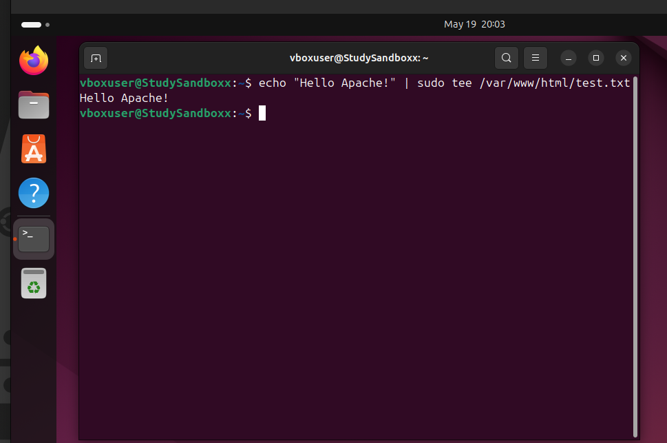
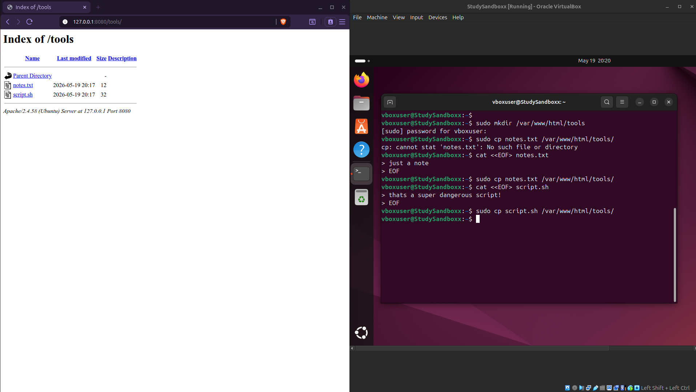
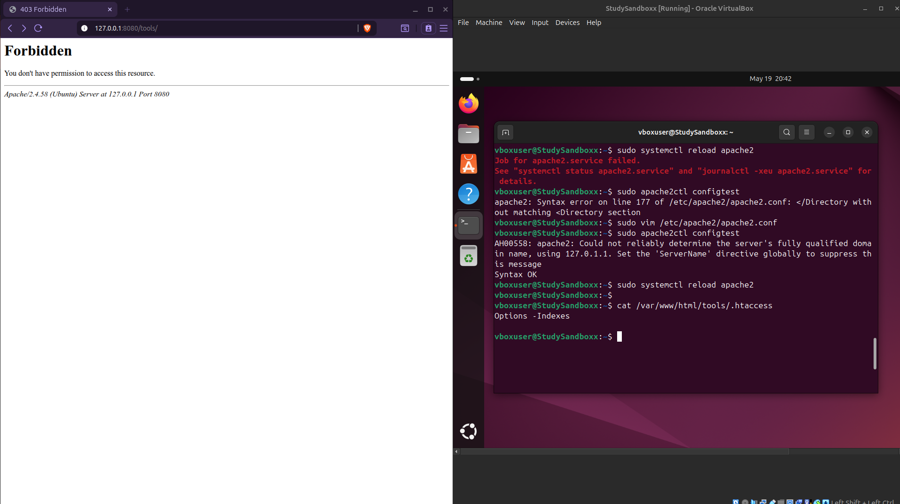

# Apache Directory Configuration Lab

This lab explains how Apache serves files from `/var/www/html`, how directory listing works, how `.htaccess` files affect Apache behavior, and how to disable directory browsing with `Options -Indexes`.

## Lab Goal

- Hosting files with Apache.
- Downloading files with `curl` or `wget`.
- Viewing directory listings.
- Disabling directory listings using `.htaccess`.
- Troubleshooting Apache reload errors.

## Repository Contents
```text
.
|-- README.md
`-- screenshots
    |-- Test-file.png
    |-- curl-other-device.png
    |-- directory-listing-index.png
    `-- override-htaccess-block-indexes.png
```

## 1. Important Apache Paths

Apache commonly serves web content from:
```text
/var/www/html
```

This local folder maps to the web root:
```text
/var/www/html/index.html  ->  http://SERVER-IP/index.html
/var/www/html/test.txt    ->  http://SERVER-IP/test.txt
```

## 2. Install and Start Apache

On Debian:
```bash
sudo apt update
sudo apt install apache2 -y
```

Start Apache:
```bash
sudo systemctl start apache2
```

Enable Apache on boot:
```bash
sudo systemctl enable apache2
```

Check the service status:
```bash
systemctl status apache2
```

## 3. Create a Test File

Create a file in Apache web root
```bash
echo "Hello Apache!" | sudo tee /var/www/html/test.txt
```

Test it:
```bash
curl http://localhost/test.txt
```

Expected result:
```text
Hello Apache!
```

If using a browser, visit:
```text
http://localhost/test.txt
```

Screenshot example:



## 4. Apache Directory Configuration Explained

Example Apache configuration:
```apache
<Directory /var/www/html>
    Options Indexes FollowSymLinks
    AllowOverride All
    Require all granted
</Directory>
```

### `<Directory /var/www/html>`

This block applies rules to the server folder:
```text
/var/www/html
```

It controls how Apache handles files and folders inside that directory.

### `Options Indexes`

This allows Apache to show a directory listing if no `index.html` file exists.

Example:
```bash
sudo mkdir /var/www/html/tools
echo "notes file" | sudo tee /var/www/html/tools/notes.txt
echo "echo script running" | sudo tee /var/www/html/tools/script.sh
```

Visit:
```text
http://localhost/tools/
```

If `Indexes` is enabled, Apache may show:

```text
Index of /tools

notes.txt
script.sh
```

This is useful in labs, but dangerous in production because it can expose files.

### `Options FollowSymLinks`

This allows Apache to follow symbolic links.

Example:

```bash
sudo ln -s /opt/shared/file.txt /var/www/html/file.txt
```

If `FollowSymLinks` is enabled, Apache may serve the linked file.

Be careful with this setting. A bad symbolic link could expose sensitive files.

Bad example:

```bash
sudo ln -s /etc/passwd /var/www/html/passwd
```

Then someone might try to access:

```text
http://localhost/passwd
```

### `AllowOverride All`

This allows `.htaccess` files to change Apache behavior inside a directory.

Example `.htaccess` file:
```bash
sudo vim /var/www/html/tools/.htaccess
```

Add:
```apache
Options -Indexes
```

This disables directory listing for `/tools`.

If Apache has this setting, it ignores `.htaccess` files:
```apache
AllowOverride None
```

To allow `.htaccess`, use:
```apache
AllowOverride All
```

### `Require all granted`

This allows everyone to access the directory over HTTP:
```apache
Require all granted
```

The opposite is:
```apache
Require all denied
```

You can also restrict access by IP:
```apache
Require ip 192.168.56.0/24
```

## 5. View Directory Listing

Visit:
```text
http://localhost/tools/
```

If directory indexing is enabled, you should see something like:
```text
Index of /tools

Parent Directory
notes.txt
script.sh
```

This happens because:

- The folder exists.
- There is no `index.html`.
- Apache has `Options Indexes` enabled.

Screenshot example:


## 6. Disable Directory Listing With `.htaccess`

Create a `.htaccess` file:
```bash
sudo vim /var/www/html/tools/.htaccess
```

Add this line:
```apache
Options -Indexes
```

Save and exit.

Check the file:
```bash
cat /var/www/html/tools/.htaccess
```

Expected:
```apache
Options -Indexes
```

Reload Apache:
```bash
sudo systemctl reload apache2
```

Now visit:
```text
http://localhost/tools/
```

Expected result:
```text
403 Forbidden
```

But direct file access should still work:
```text
http://localhost/tools/notes.txt
```

Key lesson:

- `Options -Indexes` blocks folder browsing.
- It does not block direct access to files.

Screenshot example:


## 7. If `.htaccess` Does Not Work

Apache may be ignoring `.htaccess`.

Edit the Apache configuration:
```bash
sudo vim /etc/apache2/apache2.conf
```

Find this section:
```apache
<Directory /var/www/>
    Options Indexes FollowSymLinks
    AllowOverride None
    Require all granted
</Directory>
```

Change it to:
```apache
<Directory /var/www/>
    Options Indexes FollowSymLinks
    AllowOverride All
    Require all granted
</Directory>
```

Or create a more specific block:
```apache
<Directory /var/www/html/tools>
    AllowOverride All
    Require all granted
</Directory>
```

Then test the Apache configuration:
```bash
sudo apache2ctl configtest
```

Expected:
```text
Syntax OK
```

Reload Apache:
```bash
sudo systemctl reload apache2
```

## 8. Alternative: Disable Indexes Directly in Apache Config

Instead of using `.htaccess`, you can configure Apache directly.

Edit:
```bash
sudo vim /etc/apache2/apache2.conf
```

Add:
```apache
<Directory /var/www/html/tools>
    Options -Indexes
    AllowOverride All
    Require all granted
</Directory>
```

Reload:
```bash
sudo systemctl reload apache2
```

Directory browsing should now be blocked.


## 9. Security Notes

This lab uses open settings for learning:
```apache
Options Indexes FollowSymLinks
AllowOverride All
Require all granted
```

These are convenient in a lab, but not safe in production.

More cautious production-style settings:
```apache
<Directory /var/www/html>
    Options -Indexes -FollowSymLinks
    AllowOverride None
    Require all granted
</Directory>
```

Meaning:

- Do not show directory listings.
- Do not follow symbolic links.
- Do not allow `.htaccess` overrides.
- Still allow users to access the website.


## 10. Key Takeaways

| Item | Meaning |
| --- | --- |
| `/var/www/html` | Default Apache web root. |
| `Options Indexes` | Allows directory listing if no `index.html` exists. |
| `Options -Indexes` | Disables directory listing. |
| `FollowSymLinks` | Allows Apache to follow symbolic links. |
| `AllowOverride All` | Allows `.htaccess` files to override settings. |
| `AllowOverride None` | Ignores `.htaccess` files. |
| `Require all granted` | Allows web access. |
| `Require all denied` | Blocks web access. |